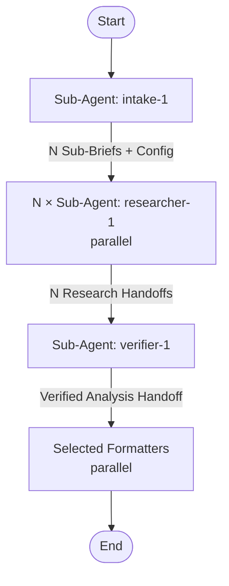

# research-and-summarize

## Workflow Diagram

## Execution Instructions

This pipeline runs **autonomously after the intake step**. There are no mid-flow user questions. The intake agent handles all user interaction upfront.

### Step 1: Run Intake Agent

Dispatch `intake-1` sub-agent with the user's research request. This agent:
- Clarifies the topic iteratively with the user (max 5 questions)
- Determines research depth, output formats, language, and topic slug
- Splits the topic into 2-4 sub-briefs

Wait for the intake agent to complete. Parse its output to extract:
- The full RESEARCH BRIEF
- The list of Sub-Briefs
- The Configuration block (depth, output_formats, language, slug)

### Step 2: Run Parallel Researchers

For each Sub-Brief from the intake output, spawn one `researcher-1` sub-agent. **Launch all researchers in a single message** so they execute in parallel.

Each researcher receives:
- Their specific Sub-Brief (focus, search angles, expected source types)
- The research depth from Configuration
- The overall Research Question for context

Wait for all researchers to complete. Collect all Research Handoffs.

### Step 3: Run Verifier

Dispatch `verifier-1` sub-agent with:
- The original RESEARCH BRIEF (for alignment checking)
- All Research Handoffs from the parallel researchers
- The Configuration block

The verifier synthesizes, analyzes, and verifies. Wait for it to complete.

### Step 4: Run Selected Formatters

Read `output_formats` from the Configuration. For each selected format, spawn the corresponding formatter sub-agent **in a single message** (parallel execution):

| Format | Agent |
|--------|-------|
| `detailed` | `detailed-1` |
| `html` | `html-report-1` |
| `keypoints` | `keypoints-1` |
| `brief` | `brief-1` |

Each formatter receives the complete Verified Analysis Handoff.

Wait for all formatters to complete. Report the output file paths to the user.

## Sub-Agent Node Details

#### intake_1 (Sub-Agent: intake-1)

**Description**: Clarify research topic iteratively and produce research brief with sub-briefs

**Model**: opus

**Tools**: AskUserQuestion

#### researcher_1..N (Sub-Agent: researcher-1, parallel instances)

**Description**: Research a sub-brief using web search with triangulation strategy

**Model**: sonnet

**Tools**: WebSearch, WebFetch, Read

#### verifier_1 (Sub-Agent: verifier-1)

**Description**: Synthesize parallel research results, analyze themes, and verify quality

**Model**: opus

**Tools**: WebSearch, WebFetch, Read

#### detailed_1 (Sub-Agent: detailed-1)

**Description**: Write detailed report and save to file

**Model**: sonnet

**Tools**: Bash, Write, Glob, Read

#### html_report_1 (Sub-Agent: html-report-1)

**Description**: Produce styled HTML report from template

**Model**: opus

**Tools**: Bash, Write, Glob, Read

#### keypoints_1 (Sub-Agent: keypoints-1)

**Description**: Extract key points for skill creation and save to file

**Model**: sonnet

**Tools**: Bash, Write, Glob, Read

#### brief_1 (Sub-Agent: brief-1)

**Description**: Write brief summary and save to file

**Model**: sonnet

**Tools**: Bash, Write, Glob, Read
