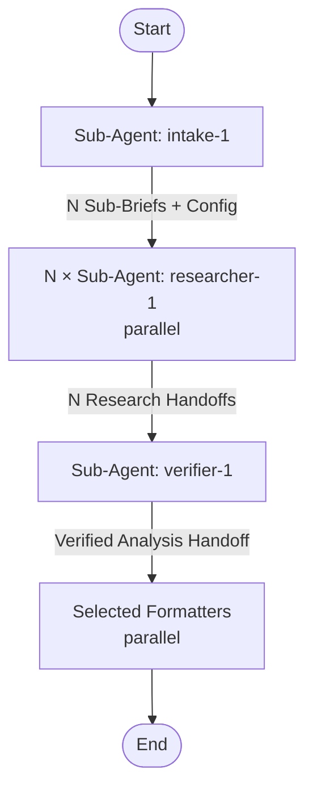

## Workflow Execution Guide

Follow the Mermaid flowchart above. This pipeline runs **autonomously after the intake step** — no mid-flow user questions.

### Execution Methods by Node Type

- **Rectangle nodes (Sub-Agent: ...)**: Execute Sub-Agents using the Agent tool
- **Parallel nodes**: Spawn multiple Agent tool calls in a single message

### Step-by-Step Execution

**1. Run intake-1** — dispatch as sub-agent with the user's research request. It clarifies the topic, gathers config (depth, output formats, language), and produces N Sub-Briefs.

**2. Parse intake output** — extract Sub-Briefs and Configuration block.

**3. Run N × researcher-1 in parallel** — for each Sub-Brief, spawn one researcher-1 Agent call in a single message. Each receives their Sub-Brief + depth + Research Question.

**4. Run verifier-1** — pass all Research Handoffs + original Research Brief + Configuration. It synthesizes, verifies, and fills gaps.

**5. Run selected formatters in parallel** — read output_formats from Configuration. Spawn only the selected formatter agents in a single message:
  - `detailed` → detailed-1
  - `html` → html-report-1
  - `keypoints` → keypoints-1
  - `brief` → brief-1

**6. Report results** — tell the user which files were created in `./research/<slug>/`.

## Sub-Agent Node Details

#### intake_1 (Sub-Agent: intake-1)
**Description**: Clarify research topic iteratively and produce research brief with sub-briefs
**Model**: opus
**Tools**: AskUserQuestion

#### researcher_1..N (Sub-Agent: researcher-1, parallel instances)
**Description**: Research a sub-brief using web search with triangulation strategy
**Model**: sonnet
**Tools**: WebSearch, WebFetch, Read

#### verifier_1 (Sub-Agent: verifier-1)
**Description**: Synthesize parallel research results, analyze themes, and verify quality
**Model**: opus
**Tools**: WebSearch, WebFetch, Read

#### detailed_1 (Sub-Agent: detailed-1)
**Description**: Write detailed report and save to file
**Model**: sonnet
**Tools**: Bash, Write, Glob, Read

#### html_report_1 (Sub-Agent: html-report-1)
**Description**: Produce styled HTML report from template
**Model**: opus
**Tools**: Bash, Write, Glob, Read

#### keypoints_1 (Sub-Agent: keypoints-1)
**Description**: Extract key points for skill creation and save to file
**Model**: sonnet
**Tools**: Bash, Write, Glob, Read

#### brief_1 (Sub-Agent: brief-1)
**Description**: Write brief summary and save to file
**Model**: sonnet
**Tools**: Bash, Write, Glob, Read
