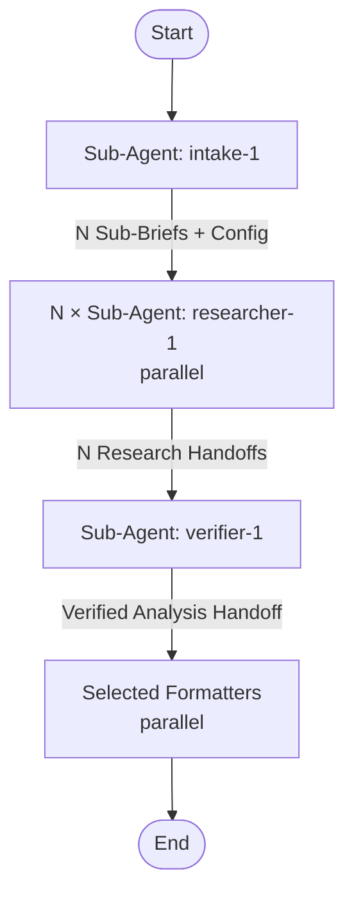

# research-and-summarize

## Workflow Diagram

## Execution Instructions

This pipeline runs **autonomously after the intake step**. There are no mid-flow user questions. The intake agent handles all user interaction upfront.

### Step 0: Resume Check (v3)

Before intake, check `research/runs/` for a `running` run matching the requested
slug. If found: read its `state.yaml`, re-validate referenced files
(`python -m contract.validate_contract <run-dir>`), and resume at the first step
not marked `done`. Do not re-run completed sub-researchers. Never touch
`blocked`/`completed` runs.

All steps below read/write files under `research/runs/<run-id>/`. Handoffs are
files, never chat-only. Update `state.yaml` atomically (temp file + rename) after
each step reaches `done`.

### Step 0.5: Adapter Selection + Capability Preflight (v3)

Dispatch mechanics and tool names are harness-specific. Select the adapter for
the harness you are running under and follow it for all dispatch:

- Claude Code → `references/adapter-claude-code.md` (`platform: claude-code`)
- Copilot CLI → `references/adapter-copilot-cli.md` (`platform: copilot-cli`)
- Unknown harness → **BLOCKED**; do not guess tool names.

Then run the **capability preflight** described in
`references/capability-model.md`. `researcher-1` and `verifier-1` both require
`web_search`, `web_fetch`, `read`, and `write`.

1. Static resolution against the harness's *registered* tools:
   `python -m contract.capabilities <platform> <registered_tool> ...`
   (exit 0 = PASS, exit 1 = BLOCKED).
2. Live probe: actually run one `web_search`, one `web_fetch`, and a
   `write`+`read` round-trip; record `preflight/capability-probe.json`.

If any required capability is missing (e.g. the profile declared tool names the
harness did not recognize, so Copilot CLI registered only `view`/`create`/`edit`
and dropped the web tools), set `state.status: blocked` with the documented cause
and **stop before any research artifact is created** — the
`researchers/sub-*/` and `verified/` folders stay empty. Never work around a
missing tool via `curl`, the parent agent, another research agent, or fabricated
sources. URL permissions (`--allow-all-urls` / `/allow-all`) do not create
missing tools and cannot clear a BLOCKED web preflight.

### Step 1: Run Intake Agent

Dispatch `intake-1` sub-agent with the user's research request. This agent:
- Clarifies the topic iteratively with the user (max 5 questions)
- Determines research depth, output formats, language, and topic slug
- Splits the topic into 2-4 sub-briefs

Wait for the intake agent to complete. Parse its output to extract:
- The full RESEARCH BRIEF
- The list of Sub-Briefs
- The Configuration block (depth, output_formats, language, slug)

### Step 2: Run Parallel Researchers

For each Sub-Brief from the intake output, spawn one `researcher-1` sub-agent. **Launch all researchers in a single message** so they execute in parallel.

Each researcher receives:
- Their specific Sub-Brief (focus, search angles, expected source types)
- The research depth from Configuration
- The overall Research Question for context
- Their exclusive output folder `researchers/sub-NN/` (v3): each researcher writes
  `findings.md`, `claims.jsonl`, and `sources.jsonl` there, reading
  `contract/contract.md` for the schema. Handoffs are files, not chat-only.

Wait for all researchers to complete. Do not reconstruct missing output from an
agent's chat reply — verify the sidecar files exist and parse.

### Step 3: Run Verifier

Dispatch `verifier-1` sub-agent with:
- The original RESEARCH BRIEF (for alignment checking)
- The path to the `researchers/sub-*/` folders (it reads their `claims.jsonl` and
  `sources.jsonl` from disk)
- The Configuration block (including `assurance`)

The verifier synthesizes, normalizes to global IDs, deduplicates sources, and
writes `verified/{analysis.md, claims.jsonl, sources.jsonl}` (plus
`verified/issues.yaml` when `assurance: high`). Wait for it to complete.

### Step 3b: Validate evidence

Run `python -m contract.validate_contract verified/`. On any error at
`assurance: high`, treat as a gate finding (Step 3c). At `assurance: standard`,
surface as a warning but continue.

### Step 3c: Evidence Gate (assurance: high only)

Read `verified/issues.yaml` and the validator output. Determine status:
- `PASS` — no unresolved blocker/high findings.
- `PASS_WITH_GAPS` — only documented medium/low gaps.
- `REWORK` — ≥1 fixable blocker/high finding and `rework_used < 2`.
- `BLOCKED` — critical source missing, or `rework_used == 2` with open blockers.

On `REWORK`: dispatch **one** targeted `researcher-1` scoped to the affected
claim IDs + the specific finding as read-only input. Re-run the verifier
normalization for the affected claims, re-validate, increment `rework_used`,
re-enter the gate. On `BLOCKED`: set `state.status: blocked` with a documented
cause and stop. On `PASS`/`PASS_WITH_GAPS`: dispatch `final-critic-1`, resolve its
findings yourself, then call the `verification-before-completion` skill before
formatting outputs.

### Step 4: Run Selected Formatters

Read `output_formats` from the Configuration. For each selected format, spawn the corresponding formatter sub-agent **in a single message** (parallel execution):

| Format | Agent |
|--------|-------|
| `detailed` | `detailed-1` |
| `html` | `html-report-1` |
| `keypoints` | `keypoints-1` |
| `brief` | `brief-1` |
| `decision` | `decision-1` |

Each formatter receives the complete Verified Analysis Handoff.

Wait for all formatters to complete. Report the output file paths to the user.

## Sub-Agent Node Details

#### intake_1 (Sub-Agent: intake-1)

**Description**: Clarify research topic iteratively and produce research brief with sub-briefs

**Model**: opus

**Tools**: AskUserQuestion, Write

#### researcher_1..N (Sub-Agent: researcher-1, parallel instances)

**Description**: Research a sub-brief using web search with triangulation strategy

**Model**: sonnet

**Tools**: WebSearch, WebFetch, Read, Write (Claude Code) · web_search, web_fetch, view, create, edit (Copilot CLI)

#### verifier_1 (Sub-Agent: verifier-1)

**Description**: Synthesize parallel research results, analyze themes, and verify quality

**Model**: opus

**Tools**: WebSearch, WebFetch, Read, Write (Claude Code) · web_search, web_fetch, view, create, edit (Copilot CLI)

#### detailed_1 (Sub-Agent: detailed-1)

**Description**: Write detailed report and save to file

**Model**: sonnet

**Tools**: Bash, Write, Glob, Read

#### html_report_1 (Sub-Agent: html-report-1)

**Description**: Produce styled HTML report from template

**Model**: opus

**Tools**: Bash, Write, Glob, Read

#### keypoints_1 (Sub-Agent: keypoints-1)

**Description**: Extract key points for skill creation and save to file

**Model**: sonnet

**Tools**: Bash, Write, Glob, Read

#### brief_1 (Sub-Agent: brief-1)

**Description**: Write brief summary and save to file

**Model**: sonnet

**Tools**: Bash, Write, Glob, Read

#### final_critic_1 (Sub-Agent: final-critic-1, assurance: high only)

**Description**: Read-only final critic that checks the synthesized draft against the evidence contract, claims, and sources without editing anything

**Model**: opus

**Tools**: Read, Write

#### decision_1 (Sub-Agent: decision-1)

**Description**: Produce a decision document (ADR style) from verified research

**Model**: opus

**Tools**: Read, Write, Bash, Glob
