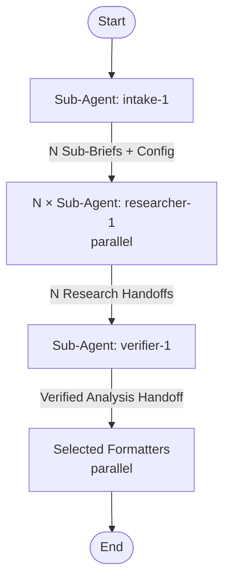

# research-and-summarize

## Workflow Diagram

## Execution Instructions

This pipeline runs **autonomously after the intake step**. No mid-flow user questions.

### Step 1: Run Intake Agent

Dispatch `intake-1` sub-agent via `#runSubagent` with the user's research request. It clarifies the topic (max 5 questions via `ask_user`), determines depth/formats/language, and produces N Sub-Briefs.

### Step 2: Run Parallel Researchers

For each Sub-Brief, spawn one `researcher-1` sub-agent. Launch all in parallel.

### Step 3: Run Verifier

Dispatch `verifier-1` with all Research Handoffs + original Research Brief + Configuration.

### Step 4: Run Selected Formatters

Read `output_formats` from Configuration. Spawn only the selected formatters in parallel:
- `detailed` → detailed-1
- `html` → html-report-1
- `keypoints` → keypoints-1
- `brief` → brief-1

Report output file paths to the user.

## Sub-Agent Details

| Agent | Model | Tools | Description |
|-------|-------|-------|-------------|
| intake-1 | opus | ask_user | Clarify topic, produce sub-briefs |
| researcher-1 (×N) | sonnet | web_search, browse, read_file | Triangulation research per sub-brief |
| verifier-1 | opus | web_search, browse, read_file | Synthesize + verify + fill gaps |
| detailed-1 | sonnet | run_shell, write_file, list_files, read_file | Markdown report |
| html-report-1 | opus | run_shell, write_file, list_files, read_file | HTML report from template |
| keypoints-1 | sonnet | run_shell, write_file, list_files, read_file | Key points for skills |
| brief-1 | sonnet | run_shell, write_file, list_files, read_file | Executive summary |
