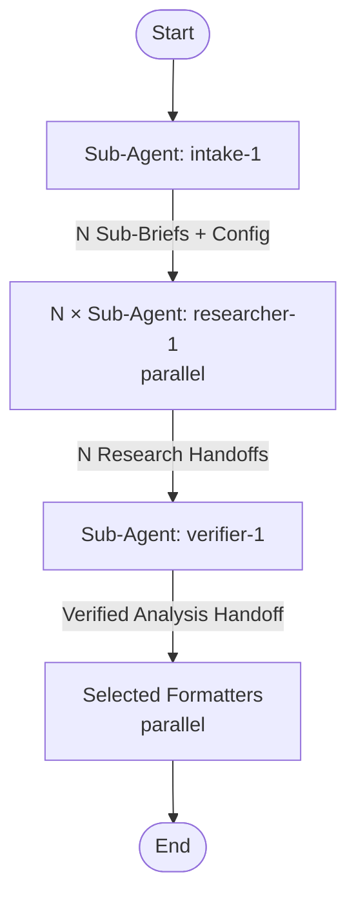

## Workflow Execution Guide

This pipeline runs **autonomously after the intake step**. No mid-flow user questions.

### Step 1: Intake
Run intake-1 agent. It clarifies the topic iteratively (max 5 questions), determines research depth (quick/standard/deep), output formats, language, and splits into N Sub-Briefs.

### Step 2: Parallel Research
For each Sub-Brief, spawn a researcher-1 agent in parallel. Each uses triangulation strategy (3-4 query variations, 3+ source types, dual-source backing, citation chain following, counter-argument search).

### Step 3: Verification
Run verifier-1 with all Research Handoffs + original Brief. It synthesizes themes, cross-references, fills gaps, builds Source Index.

### Step 4: Formatting
Run selected formatters in parallel based on intake configuration:
- detailed-1 → Markdown report
- html-report-1 → HTML from template
- keypoints-1 → Structured key points
- brief-1 → Executive summary

## Agent Details

| Agent | Model | Description |
|-------|-------|-------------|
| intake-1 | opus | Clarify topic, produce sub-briefs |
| researcher-1 (×N) | sonnet | Triangulation research per sub-brief |
| verifier-1 | opus | Synthesize + verify + fill gaps |
| detailed-1 | sonnet | Markdown report |
| html-report-1 | opus | HTML report from template |
| keypoints-1 | sonnet | Key points for skills |
| brief-1 | sonnet | Executive summary |
