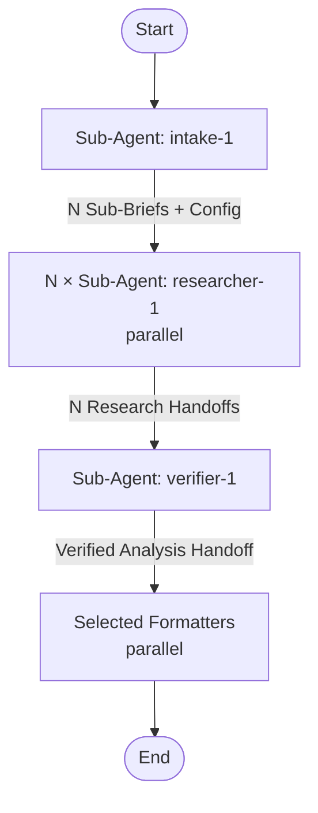

```mermaid
flowchart TD
    start_1([Start])
    intake_1[Sub-Agent: intake-1]
    researcher_parallel[N × Sub-Agent: researcher-1<br/>parallel]
    verifier_1[Sub-Agent: verifier-1]
    formatters[Selected Formatters<br/>parallel]
    end_1([End])

    start_1 --> intake_1
    intake_1 -->|N Sub-Briefs + Config| researcher_parallel
    researcher_parallel -->|N Research Handoffs| verifier_1
    verifier_1 -->|Verified Analysis Handoff| formatters
    formatters --> end_1
```

## Workflow Execution Guide

This pipeline runs **autonomously after the intake step**. No mid-flow user questions.

### Step 0: Adapter Selection + Capability Preflight

You are running under **Copilot CLI** → use `references/adapter-copilot-cli.md`
(`platform: copilot-cli`) for dispatch and tool names.

`researcher-1` and `verifier-1` need four canonical capabilities: `web_search`,
`web_fetch`, `read`, `write`. On Copilot CLI (verified 1.0.76): `web_fetch`,
`view`, `create`/`edit` are native; `web_search` is the GitHub-MCP tool
`github-mcp-server-web_search` and **may be absent** (in testing it was absent
even with `--enable-all-github-mcp-tools`). Profiles declare the Copilot names
(the shared `agents/*.md` declare both Copilot and Claude names); declaring only
Claude names (`WebSearch`/`WebFetch`) caused the original failure — Copilot
dropped them and left only `view`/`create`/`edit`.

Run the preflight before any research:

```bash
python -m contract.capabilities copilot-cli web_search web_fetch view create edit
# -> static PASS; exit 0  (names resolve — the live probe is authoritative)
python -m contract.capabilities copilot-cli view create edit
# -> BLOCKED (web_search, web_fetch missing); exit 1  ← the original regression
```

Then **live-probe**: actually call one `web_search`, one `web_fetch`, and a
`write`+`read` round-trip. A static PASS does not prove `web_search` runs. If any
required capability does not execute (e.g. Copilot has no provisioned
`web_search`), **stop before writing any artifact** and report BLOCKED — no
`curl`, parent-agent, other-agent, or fabricated-source fallback; a search-less
run is not acceptable for triangulation. `/allow-all` only widens URL access for
existing tools; it cannot provision a missing one. See
`references/capability-model.md`.

### Step 1: Intake
Run intake-1 agent. It clarifies the topic iteratively (max 5 questions), determines research depth (quick/standard/deep), output formats, language, and splits into N Sub-Briefs.

### Step 2: Parallel Research
For each Sub-Brief, spawn a researcher-1 agent in parallel. Each uses triangulation strategy (3-4 query variations, 3+ source types, dual-source backing, citation chain following, counter-argument search).

### Step 3: Verification
Run verifier-1 with all Research Handoffs + original Brief. It synthesizes themes, cross-references, fills gaps, builds Source Index.

### Step 4: Formatting
Run selected formatters in parallel based on intake configuration:
- detailed-1 → Markdown report
- html-report-1 → HTML from template
- keypoints-1 → Structured key points
- brief-1 → Executive summary

## Agent Details

| Agent | Model | Description |
|-------|-------|-------------|
| intake-1 | opus | Clarify topic, produce sub-briefs |
| researcher-1 (×N) | sonnet | Triangulation research per sub-brief |
| verifier-1 | opus | Synthesize + verify + fill gaps |
| detailed-1 | sonnet | Markdown report |
| html-report-1 | opus | HTML report from template |
| keypoints-1 | sonnet | Key points for skills |
| brief-1 | sonnet | Executive summary |
