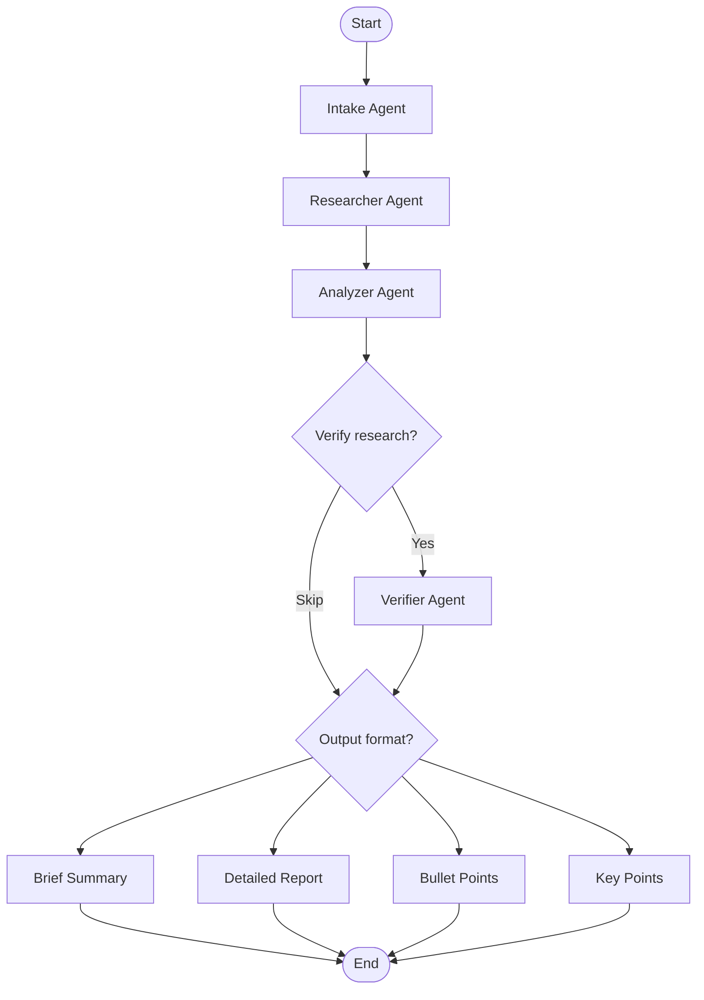

# Research Template

A multi-agent research and summarization workflow built with **[Claude Code Workflow Studio](https://marketplace.visualstudio.com/items?itemName=breaking-brake.cc-wf-studio)** (v3.26.0) -- a free, open-source VS Code extension for visual AI agent orchestration.

> **Extension**: [CC Workflow Studio on VS Code Marketplace](https://marketplace.visualstudio.com/items?itemName=breaking-brake.cc-wf-studio)
> **Source**: [github.com/breaking-brake/cc-wf-studio](https://github.com/breaking-brake/cc-wf-studio)
> **License**: AGPL-3.0

---

## What is Claude Code Workflow Studio?

CC Workflow Studio is a **visual drag-and-drop editor** for designing multi-agent AI workflows. Instead of writing agent orchestration code by hand, you design workflows on a canvas and export them as ready-to-run slash commands, agent skills, and prompt files.

### Key capabilities

- **Visual workflow editor** -- drag-and-drop canvas for connecting agents, decision nodes, and tools
- **Edit with AI** -- iteratively refine workflows through natural language conversation
- **One-click export** -- generates `.claude/commands/`, `.claude/agents/`, `.agent/skills/`, `.gemini/skills/`, and `.github/prompts/` automatically
- **MCP integration** -- built-in MCP server (`get_workflow_schema`, `get_current_workflow`, `apply_workflow`) for programmatic workflow editing
- **Multi-agent support** -- works with Claude Code, GitHub Copilot, Gemini CLI, OpenAI Codex CLI, Roo Code, Cursor, and more

### How to use it

1. Install the extension from the [VS Code Marketplace](https://marketplace.visualstudio.com/items?itemName=breaking-brake.cc-wf-studio)
2. Open the editor: click the icon in the editor's top-right corner, or `Cmd+Shift+P` > "CC Workflow Studio: Open Editor"
3. Design your workflow on the canvas -- add sub-agent nodes, decision nodes, connect them
4. Export to your target platform(s) with one click
5. Run the generated slash command (e.g., `/research-and-summarize`) directly in Claude Code

---

## This Template: Research & Summarize Workflow

This repository is a **ready-to-use research template** exported from CC Workflow Studio. It implements a 5-stage multi-agent pipeline for structured research.

### Workflow architecture

```
START -> INTAKE -> RESEARCHER -> ANALYZER -> VERIFY? -> FORMAT SELECT -> OUTPUT -> END
```



### The agents

| Stage | Agent | Model | Role |
|-------|-------|-------|------|
| 1. Intake | `intake-1` | Sonnet | Clarifies the research topic, asks follow-ups, produces a structured Research Brief |
| 2. Research | `researcher-1` | Sonnet | Searches the web, reads sources, produces a structured Research Handoff |
| 3. Analysis | `analyzer-1` | Sonnet | Cross-references sources, identifies 3-5 themes, assesses quality |
| 4. Verification | `verifier-1` | Opus | (Optional) Reviews quality, fills gaps with additional research, scores 1-10 |
| 5. Output | `brief-1` / `detailed-1` / `bullets-1` / `keypoints-1` | Sonnet/Opus | Writes the chosen format(s) and saves to `./research/<topic-slug>/` |

### Structured handoff protocol

Agents communicate through typed handoff documents, not free-form text:

- **Research Brief** (Intake -> Researcher): Topic, question, scope, time focus, priorities
- **Research Handoff** (Researcher -> Analyzer): Sources, facts, perspectives, data, gaps
- **Analysis Handoff** (Analyzer -> Formatters): Quality assessment, themes, takeaways, unknowns
- **Verified Analysis Handoff** (Verifier -> Formatters): Enhanced analysis with quality scores

### Output

Research results are saved to auto-versioned markdown files with YAML frontmatter:

```
./research/
  <topic-slug>/
    brief-summary.md        # 2-3 paragraph executive summary
    detailed-report.md       # Multi-section report with citations
    bullet-points.md         # Organized bullet points by theme
    key-points.md            # Structured extraction for skill creation
```

---

## Running the workflow

### Option 1: Claude Code slash command

```
/research-and-summarize
```

Then provide your research topic when prompted.

### Option 2: Edit workflows with AI (requires VS Code)

With the CC Workflow Studio extension active in VS Code:

```
/cc-workflow-ai-editor
```

This connects to the extension's MCP server to interactively create or modify workflows through conversation.

### MCP configuration

The project includes an MCP config (`.mcp.json`) that connects to the CC Workflow Studio extension:

```json
{
  "mcpServers": {
    "cc-workflow-studio": {
      "type": "http",
      "url": "http://127.0.0.1:64247/mcp"
    }
  }
}
```

The MCP server exposes three tools:
- `get_workflow_schema` -- returns the JSON schema for workflow files
- `get_current_workflow` -- returns the workflow currently open in the visual editor
- `apply_workflow` -- pushes a workflow JSON to the visual editor canvas

> **Note**: The MCP server is only available when the CC Workflow Studio extension is running in VS Code.

---

## Project structure

```
.claude/
  agents/           # 8 agent definitions (intake, researcher, analyzer, verifier, 4 formatters)
  commands/          # Slash commands (research-and-summarize, cc-workflow-ai-editor)
  settings.local.json
.agent/skills/       # Skills for Claude Code
.gemini/skills/      # Skills for Gemini CLI
.github/prompts/     # Prompts for GitHub Copilot
.vscode/workflows/   # Source workflow JSON (editable in CC Workflow Studio)
.mcp.json            # MCP server configuration
```

---

## Cross-platform support

This template is exported for multiple AI coding platforms simultaneously:

| Platform | Location | How to run |
|----------|----------|------------|
| Claude Code | `.claude/commands/` + `.claude/agents/` | `/research-and-summarize` |
| Claude Code Skills | `.agent/skills/` | Auto-detected |
| Gemini CLI | `.gemini/skills/` | Auto-detected |
| GitHub Copilot | `.github/prompts/` | Via Copilot Chat |
