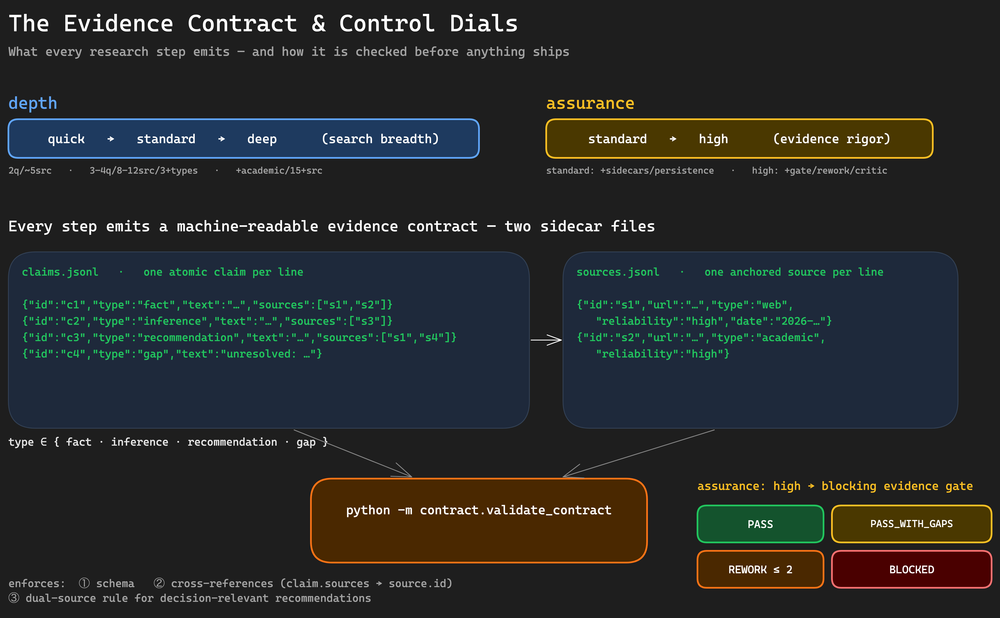

# research-toolkit

A Claude Code plugin for structured, multi-agent web research with parallel execution, source verification, and formatted output generation.

## Installation

**As a plugin (recommended):**
```bash
claude --plugin-dir /path/to/research-toolkit
```

**Or clone and use directly:**
```bash
git clone https://github.com/vmeyer/research-toolkit.git
cd research_template
claude
```

Then run `/research-toolkit:research-and-summarize` (plugin) or `/research-and-summarize` (standalone).

## What it does

You give it a topic. It clarifies what you need, splits the research into parallel tracks, searches the web with a triangulation strategy, verifies and synthesizes the results, and produces formatted reports — all autonomously after the initial intake.

### Pipeline

```
Intake (opus) → N × Researcher (sonnet, parallel) → Verifier (opus) → validate
   → [ Evidence Gate ⟳ rework ≤2 → final-critic ]  (assurance: high only)
   → Formatter(s) (parallel) → outputs
```


*Read it left→right: a single intake, a parallel **fan-out** of researchers, **convergence** at the verifier, contract validation, and — on `assurance: high` — a blocking **evidence gate** with a bounded **rework loop** back to the verifier, then a **fan-out** to the selected formatters. Purple = LLM sub-agents (model in parentheses); the green track is the "passed" path, red is `BLOCKED`, amber is the rework loop.*

**How a run flows**

0. **Resume check** — if a `running` run exists for the topic slug under `research/runs/<id>/`, re-validate its files and continue at the first unfinished step instead of restarting.
1. **`intake-1`** (opus) — the *single* interaction point: clarifies the topic (≤5 questions), sets the two dials, output formats and language, and splits the topic into 2–4 sub-briefs. Everything after this runs without interruption.
2. **`researcher-1` ×N** (sonnet, parallel) — one per sub-brief, launched together. Each searches with the triangulation strategy and writes its own `findings.md` + `claims.jsonl` + `sources.jsonl` to disk (handoffs are files, never chat-only).
3. **`verifier-1`** (opus) — merges the researchers, normalizes to global claim/source IDs, deduplicates, and writes `verified/{analysis,claims,sources}` (+ `issues.yaml` on `assurance: high`).
4. **validate + evidence gate** — `contract.validate_contract` checks the sidecars. On `assurance: standard` this only warns; on `assurance: high` a blocking gate resolves to `PASS` / `PASS_WITH_GAPS` / `REWORK` (targeted re-research, ≤2 rounds) / `BLOCKED`, and a read-only **`final-critic-1`** checks the draft against the contract before anything is formatted.
5. **formatters** (parallel) — only the selected ones (`detailed-1`, `html-report-1`, `keypoints-1`, `brief-1`, `decision-1`) run, each consuming the verified handoff, writing to `research/<slug>/`.

### Agents

| Agent | Model | Role |
|-------|-------|------|
| intake-1 | opus | Clarifies topic iteratively, determines depth/formats/language, splits into 2-4 sub-briefs |
| researcher-1 (×N) | sonnet | Executes one sub-brief each using triangulation search strategy |
| verifier-1 | opus | Merges results, synthesizes themes, verifies quality, fills gaps |
| detailed-1 | sonnet | Comprehensive Markdown report |
| html-report-1 | opus | Styled HTML report from template |
| keypoints-1 | sonnet | Structured key points for skill creation |
| brief-1 | sonnet | Executive summary (2-3 paragraphs) |
| decision-1 | opus | Decision document (ADR style) — recommendation, alternatives, criteria, risks, PoC |
| final-critic-1 | opus | Read-only critic for `assurance: high` runs — checks the draft against the evidence contract |

### Research strategy: Triangulation

Three depth levels, configurable during intake:

- **quick** — 2 query variations, ~5 sources, fast overview
- **standard** (default) — 3-4 query variations, 8-12 sources, 3+ source types, counter-argument search, citation chain following
- **deep** — All of standard plus academic sources, expert tracking, 15+ sources

Every key claim is backed by at least 2 independent sources. Full source traceability from researcher through verifier to final output.

### Evidence-grade orchestration (v3)

v3 adds an evidence-rigor layer on top of the v2 pipeline, controlled by **two
orthogonal dials**:

| Dial | Values | What it controls |
|------|--------|------------------|
| `depth` | `quick` · `standard` · `deep` | How much the researchers search (breadth of sources). |
| `assurance` | `standard` · `high` | How hard the evidence is checked before it ships. |



*The control model at a glance: the two dials (top), the two sidecar files every step emits with a real line of each — `claims.jsonl` classified `fact` / `inference` / `recommendation` / `gap` and `sources.jsonl` anchored by id — the validator that enforces schema + cross-references + the dual-source rule, and the four evidence-gate outcomes that apply on `assurance: high`.*

Every research step now emits a **machine-readable evidence contract** — two
sidecar files, `claims.jsonl` (one atomic claim per line, classified as
`fact` / `inference` / `recommendation` / `gap`) and `sources.jsonl` (one anchored
source per line). A Python validator (`python -m contract.validate_contract <dir>`)
enforces the schema, cross-references, and a dual-source rule for
decision-relevant recommendations. The full contract lives in
[`contract/contract.md`](contract/contract.md).

Runs are **persisted and resumable**. Each run gets a folder under
`research/runs/<run-id>/` with a `brief.md` and a `state.yaml`; the orchestrator
re-validates files on re-entry and continues at the first unfinished step instead
of re-running completed work. `assurance: standard` keeps the v2 behavior
user-visible (sidecars + persistence are added internally). `assurance: high`
additionally runs a **blocking evidence gate**, a targeted **rework loop**
(max 2 rounds), and a read-only **final critic** before any output is formatted.
A new `decision` output format produces an ADR-style decision document from the
verified evidence.

### Output

Reports are saved to `./research/<topic-slug>/` with auto-versioning:

```
./research/webassembly-enterprise-adoption/
  detailed-report-v1.md     # Full report with citations
  report-v1.html            # Styled HTML (from template)
  key-points-v1.md          # Structured for skill creation
  brief-summary-v1.md       # Executive summary
```

All files include YAML frontmatter with topic, date, version, language, sources count, and completeness score.

## Dashboard

After running multiple research sessions, generate an overview page:

```
/research-toolkit:research-dashboard
```

This reads all HTML reports from `./research/` and creates a static `index.html` with links, scores, and summary excerpts.

## Skills

| Skill | Description |
|-------|-------------|
| `research-and-summarize` | Full research pipeline |
| `research-dashboard` | Aggregate HTML reports into dashboard |

## Project structure

The repository **root is the plugin**: `.claude-plugin/plugin.json` plus the
canonical `agents/`, `skills/`, `commands/`, `contract/`, and `references/`
directories. It is the single source of truth.

```
research-toolkit/
├── .claude-plugin/
│   ├── plugin.json              # Plugin manifest
│   └── marketplace.json         # Marketplace catalog (enables /plugin install)
├── agents/                      # Agent definitions (canonical, 9 agents)
├── skills/                      # Skills (canonical)
│   ├── research-and-summarize/
│   └── research-dashboard/
├── commands/                    # Slash commands (canonical, Claude Code)
├── contract/                    # Evidence contract spec + Python validator
├── references/                  # Harness adapter references
├── templates/
│   └── report.html              # HTML report template
├── scripts/
│   └── sync-mirrors.sh          # Regenerates .claude/ + .codex-plugin/ from root
├── .codex-plugin/
│   └── plugin.json              # GENERATED Codex CLI manifest — DO NOT EDIT
└── .claude/                     # GENERATED standalone mirror — DO NOT EDIT
    └── agents/ commands/ skills/ contract/ references/
```

`.claude/` and `.codex-plugin/plugin.json` are **generated** from the root
sources by `scripts/sync-mirrors.sh`; never edit them by hand. Run the script
after changing any canonical source, and `./scripts/sync-mirrors.sh --check`
in CI to catch drift.

## Cross-platform support

| Platform | How to use |
|----------|------------|
| Claude Code (marketplace) | `/plugin marketplace add vmeyer/research-toolkit` → `/plugin install research-toolkit@research-toolkit` |
| Claude Code (plugin dir) | `claude --plugin-dir .` → `/research-toolkit:research-and-summarize` |
| Claude Code (standalone) | Clone repo, open in Claude Code → `/research-and-summarize` (uses generated `.claude/`) |
| GitHub Copilot CLI | Shared plugin format — auto-detects `.claude-plugin/plugin.json`; **skills** run natively (see caveats) |
| Codex CLI | Install the plugin; Codex reads the generated `.codex-plugin/plugin.json` (**skills** only, see caveats) |

### One source, shared format

Claude Code, GitHub Copilot CLI, and VS Code share a single plugin format and
all resolve `.claude-plugin/plugin.json`, so the root plugin serves them
directly — no per-tool mirror is maintained. Codex CLI uses a parallel manifest
(`.codex-plugin/plugin.json`), which is **generated** from the same
`plugin.json` so it never drifts. The generated artifacts are therefore just
`.claude/` (standalone path) and `.codex-plugin/plugin.json` (Codex).

**Harness caveats** — the pipeline is skill-orchestrated, so **skills**
(`skills/**/SKILL.md`) run natively everywhere. Two Claude-specific pieces do
not port:

- **Slash commands** (`commands/`) are **Claude-only** — neither Copilot nor
  Codex has a commands component. Trigger the research skill directly instead.
- **Agents** — Copilot expects `agents/*.agent.md` and Codex plugins declare no
  agents at all; the canonical `agents/*.md` are not auto-registered on either.
  Full sub-agent pipeline parity on non-Claude harnesses is tracked separately.

opencode and Antigravity are intentionally out of scope; they can still consume
the portable `SKILL.md` skills through their own install mechanisms.

## License

MIT
